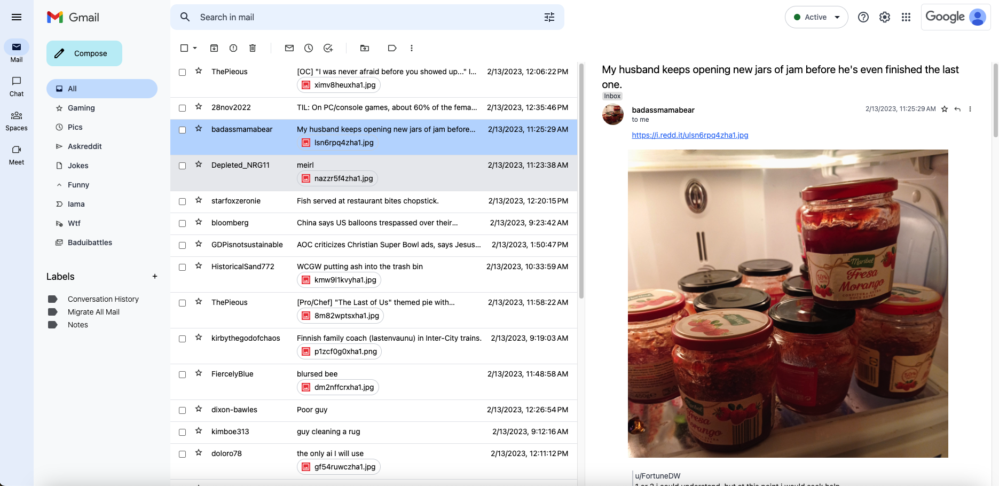

# GmailKit

## What is it?

GmailKit is a Reddit client that looks just like Gmail. It's been developed in 3 hours. There are inconsistencies and bugs. It's just a joke.

It was inspired by [this github project](https://github.com/pcottle/MSOutlookit/)

## How to use it?

Just open the `index.html` file in your browser. You can also use the [online version](http://niturobert.github.io/gmailkit/).

## Technologies

- [Alpine.js](https://alpinejs.dev/)
- [Tailwind CSS](https://tailwindcss.com/)
- [GitHub Pages](https://pages.github.com/)
- [Reddit API](https://www.reddit.com/dev/api/)
- [Gmail](https://mail.google.com/)
